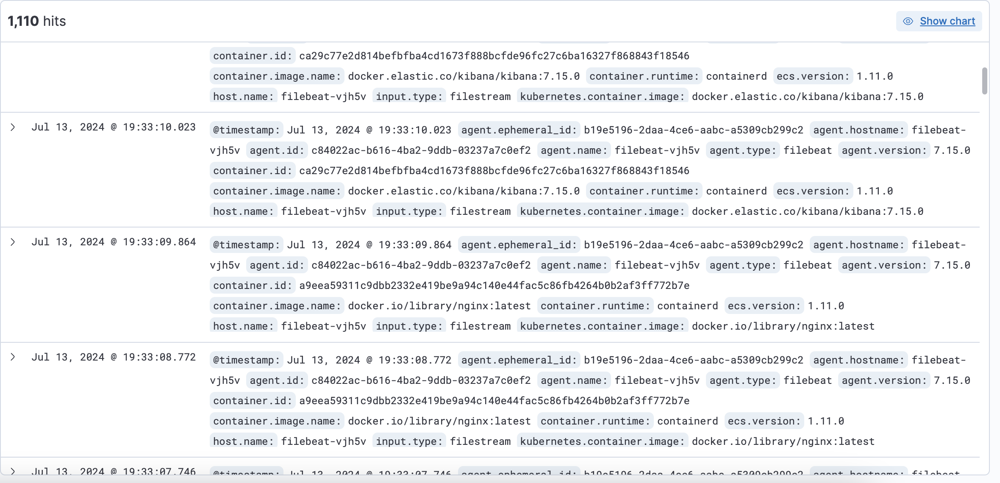

# Kubernetes Deployment Exercise

This repository contains the Kubernetes configurations for deploying various components of the Elastic Stack (Elasticsearch, Kibana, and Filebeat) along with a basic Hello World application in a Kubernetes cluster. This setup is intended for development and testing purposes.

## Repository Structure

- **Elasticsearch**: Configuration for deploying a single-node Elasticsearch instance.
- **Kibana**: Configuration for deploying Kibana.
- **Filebeat**: Configuration for deploying Filebeat to collect logs and send them to Elasticsearch.
- **Hello World Application**: A simple application to generate logs for testing the logging setup.
- **Miscellaneous Configurations**: Additional configurations supporting the Elastic Stack and related applications.

Each component is configured with simplicity in mind, suitable for development and testing environments.

## Elasticsearch Deployment

### Overview

The provided configuration is designed for a simple, single-node Elasticsearch setup, suitable for development, testing, or low-traffic environments. It uses `discovery.type: single-node` to simplify the deployment process.

### Namespace

A dedicated namespace is created for Elasticsearch to ensure isolation and better management.

### StorageClass

The `gp3` EBS volume type is used for cost-effectiveness and performance.

### Deployment Configuration

#### StatefulSet

The StatefulSet configuration includes:
- **Single Replica**: One replica is used to keep the setup simple and resource-efficient.
- **Environment Variables**: `discovery.type: single-node` is set for single-node operation, avoiding the complexity of multi-node cluster settings.

#### Service

A headless service is configured to enable communication between Elasticsearch nodes.

### Liveness and Readiness Probes

1. **Liveness Probe**:
   - **Path**: `/_cluster/health`
   - **Purpose**: Ensures Elasticsearch is running and restarts the pod if it becomes unresponsive.

2. **Readiness Probe**:
   - **Path**: `/_cluster/health?wait_for_status=yellow&timeout=50s`
   - **Purpose**: Ensures Elasticsearch is ready to serve traffic before it starts receiving requests.

### Key Choices and Their Reasons

1. **Single-Node Configuration**:
   - **`discovery.type: single-node`**: Chosen for simplicity in a low-traffic, development, or testing environment. This configuration avoids the complexity of multi-node cluster settings, making it easier to set up and manage.

2. **Single Replica**:
   - **One Replica**: Suitable for scenarios with low traffic and minimal resource requirements. This setup is ideal for learning, development, or testing purposes where high availability and clustering are not necessary.

### Note for More Important Environments

- **Multi-Node Setup**: For production environments or scenarios with more significant data and traffic, it's recommended to use a multi-node Elasticsearch cluster.
- **Higher Availability and Fault Tolerance**: Configuring multiple replicas with the default discovery mechanism (`Zen Discovery`) ensures high availability, better performance, and fault tolerance.
- **Cluster Configuration**: Use environment variables like `discovery.seed_hosts` and `cluster.initial_master_nodes` to enable proper node discovery and cluster formation.

### Conclusion

This configuration provides a straightforward Elasticsearch setup for development and testing. For production use, consider expanding to a multi-node cluster to take advantage of Elasticsearch's full capabilities in terms of high availability and fault tolerance.

For detailed resource configurations, refer to the respective YAML files in the [Elasticsearch folder](./elasticsearch).

## Kibana Deployment

### Overview

The provided configuration is designed for a simple, single-instance Kibana setup, suitable for development, testing, or low-traffic environments. This deployment ensures that Kibana is accessible within the Kubernetes cluster and integrates seamlessly with Elasticsearch.

### Namespace

Kibana is deployed in the `efk-stack` namespace, which is dedicated to the Elasticsearch, Filebeat, and Kibana stack for better management and isolation.

### Deployment Configuration

#### Deployment

The Deployment configuration includes:
- **Single Replica**: One replica is used to keep the setup simple and resource-efficient.
- **Environment Variables**: Configured to connect to the Elasticsearch service within the cluster.

#### Service

A `ClusterIP` service is configured to expose Kibana within the cluster, making it accessible to other services and users internally.

### Key Choices and Their Reasons

1. **Single-Instance Configuration**:
   - **Single Replica**: Chosen for simplicity in a low-traffic, development, or testing environment. This setup avoids the complexity of managing multiple Kibana instances, making it easier to set up and manage.

2. **Environment Variables**:
   - **`ELASTICSEARCH_HOSTS`**: Points to the Elasticsearch service (`http://elasticsearch.efk-stack:9200`) to enable Kibana to communicate with Elasticsearch.

3. **Service Type**:
   - **ClusterIP**: Exposes Kibana within the cluster, ensuring internal accessibility for other services and applications.

### Liveness and Readiness Probes

1. **Liveness Probe**:
   - **Path**: `/api/status`
   - **Purpose**: Ensures Kibana is running and restarts the pod if it becomes unresponsive.

2. **Readiness Probe**:
   - **Path**: `/api/status`
   - **Purpose**: Ensures Kibana is ready to serve traffic before it starts receiving requests.

### Note for More Important Environments

- **Multiple Instances**: For production environments or scenarios with more significant data and traffic, consider deploying multiple Kibana instances behind a load balancer for high availability and fault tolerance.
- **External Access**: If Kibana needs to be accessed from outside the cluster, consider setting up an Ingress resource or using a NodePort/LoadBalancer service type.

### Conclusion

This configuration provides a straightforward Kibana setup for development and testing. For production use, consider expanding to multiple instances and configuring external access as needed. 

For detailed resource configurations, refer to the respective YAML files in the [Kibana folder](./kibana).

## Filebeat Deployment

### Overview

The provided configuration is designed for deploying Filebeat as a DaemonSet in a Kubernetes cluster, suitable for development, testing, or low-traffic environments. Filebeat collects logs from Kubernetes nodes and forwards them to Elasticsearch.

### Namespace

Filebeat is deployed in the `efk-stack` namespace, which is dedicated to the Elasticsearch, Filebeat, and Kibana stack for better management and isolation.

### Deployment Configuration

#### DaemonSet

The DaemonSet configuration includes:
- **Environment Variables**: Configured to connect to the Elasticsearch service within the cluster and to set the node name.
- **Volume Mounts**: Mounts necessary directories to collect logs from the host.
- **Liveness Probe**: Ensures Filebeat is running and restarts the pod if it becomes unresponsive.
- **Readiness Probe**: Ensures Filebeat is ready to send logs to Elasticsearch before receiving traffic.

### Key Choices and Their Reasons

1. **DaemonSet Configuration**:
   - **DaemonSet**: Ensures Filebeat runs on every node in the cluster, collecting logs from all pods.
   - **Environment Variables**: 
     - **`ELASTICSEARCH_HOST`**: Points to the Elasticsearch service (`http://elasticsearch.efk-stack:9200`) to enable Filebeat to forward logs.
     - **`NODE_NAME`**: Uses the node name for adding Kubernetes metadata to logs.
   - **Volume Mounts**:
     - **/var/log**: Mounts the host's log directory to collect logs.
     - **/var/lib/docker/containers**: Mounts the Docker containers directory to access container logs.

2. **Liveness Probe**:
   - **Command**: `curl --fail 127.0.0.1:5066`
   - **Purpose**: Ensures Filebeat is running and restarts the pod if it becomes unresponsive.

3. **Readiness Probe**:
   - **Command**: `filebeat test output`
   - **Purpose**: Ensures Filebeat is ready to send logs to Elasticsearch before receiving traffic.

### Note for More Important Environments

- **Resource Allocation**: Adjust resource requests and limits based on the actual log volume and performance requirements.
- **Multiple Instances**: Ensure adequate scaling to handle log collection from all nodes in larger clusters.
- **External Access**: If external access to logs is required, consider setting up appropriate access controls and secure endpoints.

### Conclusion

This configuration provides a straightforward Filebeat setup for development and testing. For production use, consider scaling appropriately and configuring resources based on actual log volume and performance needs.

For detailed resource configurations, refer to the respective YAML files in the [Filebeat folder](./filebeat).

## Hello World Application Deployment

### Overview

The provided configuration is designed for a simple, single-instance Hello World application setup using Nginx, suitable for development, testing, or low-traffic environments. This deployment ensures that the Hello World application is accessible within the Kubernetes cluster and generates logs for testing the logging setup.

### Namespace

The Hello World application is deployed in the `hello-world` namespace, ensuring isolation and better management.

### Deployment Configuration

#### ConfigMap

A ConfigMap is used to store the HTML content that will be served by the Nginx server. This makes it easy to manage and update the web content separately from the application code.

#### Deployment

The Deployment configuration includes:
- **Single Replica**: One replica is used to keep the setup simple and resource-efficient.
- **Environment Variables**: Configured to serve the static HTML content from the ConfigMap.

#### Service

A `ClusterIP` service is configured to expose the Hello World application within the cluster, making it accessible to other services and users internally.

### Key Choices and Their Reasons

1. **Single-Instance Configuration**:
   - **Single Replica**: Chosen for simplicity in a low-traffic, development, or testing environment. This setup avoids the complexity of managing multiple instances, making it easier to set up and manage.

2. **ConfigMap for HTML Content**:
   - **ConfigMap**: Separates the web content from the application code, making it easy to manage and update.

3. **Service Type**:
   - **ClusterIP**: Exposes the Hello World application within the cluster, ensuring internal accessibility for other services and applications.

### Liveness and Readiness Probes

1. **Liveness Probe**:
   - **Path**: `/`
   - **Purpose**: Ensures the Nginx server is running and restarts the pod if it becomes unresponsive.

2. **Readiness Probe**:
   - **Path**: `/`
   - **Purpose**: Ensures the Nginx server is ready to serve traffic before it starts receiving requests.

### Conclusion

This configuration provides a straightforward Hello World application setup for development and testing. For production use, consider scaling appropriately and configuring resources based on actual traffic and performance needs.

For detailed resource configurations, refer to the respective YAML files in the [Hello World folder](./hello-world).

## Miscellaneous Configurations

### Overview

The `misc` folder contains additional Kubernetes configurations that support the overall deployment and management of the Elastic Stack and related applications. These configurations include a namespace for the Elastic Stack components and a utility pod used for generating logs.

### EFK Namespace

A dedicated namespace `efk-stack` is created to host all the Elastic Stack components (Elasticsearch, Filebeat, and Kibana). This ensures isolation, better management, and organization of resources.

### Curl Pod

The `curlpod` is a simple utility pod deployed in the `hello-world` namespace. It is used to generate logs for testing and verifying the logging setup. This pod runs a container with the `appropriate/curl` image and executes a sleep command, allowing manual log generation through `curl` commands.

### Conclusion

These miscellaneous configurations provide essential support for the Elastic Stack deployment and log generation, ensuring a complete and functional setup for development and testing purposes.

For detailed resource configurations, refer to the respective YAML files in the [misc folder](./misc).

## Results

The following images from Kibana illustrate that logs from the deployed applications are being received and processed correctly. These visualizations help verify that the logging setup is functioning as intended.

### Image 1: Random Logs

This image shows a selection of random logs collected by Filebeat, including logs from the Nginx container (which is part of the Hello World application).

### Image 2: Log Distribution by Namespace

This image displays the distribution of log records grouped by Kubernetes namespace. It demonstrates that the `hello-world` namespace is responsible for almost 60% of the log records.

### Image 3: Log Distribution by Container Name

This image shows the distribution of log records based on the container name. It highlights that the Nginx container (part of the Hello World application) is responsible for nearly 63% of the log records.

These visualizations confirm that the logging setup captures and processes logs from all deployed components, providing a comprehensive view of the system's log data.
